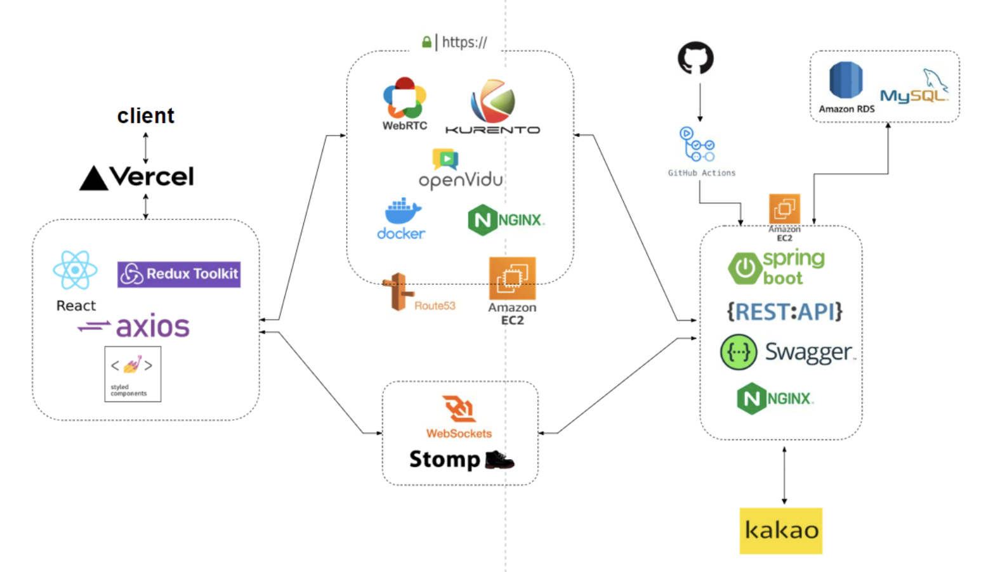

# 코코딩딩

원하는 공부를 함께 하는 온라인 화상채팅 스터디 방 만들기 웹사이트 ✨

 
 

# 서비스 소개

## 프로젝트 동기

코코딩딩 웹서비스의 기획 배경은 현대인들이 공부를 할 때 독학으로만 하지 않고, 다른 사람들과 함께 공부하면서 자극을 받고 더욱 효율적인 학습을 할 수 있도록 돕기 위함입니다.
또한, 현대인들이 일상에서 쉽게 접할 수 있는 명언이나 할 일 목록 등의 요소를 통해 하루를 더욱 의미있게 보낼 수 있도록 도와줍니다.
이러한 배경을 토대로 저희 팀은 코코딩딩 웹서비스를 기획하였습니다.

 

[도메인 주소](https://cocodingdings.vercel.app/)

[발표 영상](https://www.canva.com/design/DAFcwdozTV4/HCQVn8mTXPYgxsDkTWEaPg/view?utm_content=DAFcwdozTV4&utm_campaign=share_your_design&utm_medium=link&utm_source=shareyourdesignpanel)

 

## 서비스 화면
- 방 만들기 및 화상 채팅
 

 

- 실시간 채팅
 

## 개발 기간

- 2023.02.02 ~ 2023.03.11

## FE

김혜성
김지석

## BE

김재광
왕윤종
김현우

## UI & UX Designer

박서연

 
 

# 주요 기능

## 토큰 인증 로그인 및 소셜 로그인

- JWT 토큰 인증 방식으로 로그인 기능 구현
- 카카오 로그인 구현

## 화상 채팅

- webRTC를 이용한 화상 채팅 기능 구현

## 실시간 채팅

- webSocket을 이용한 실시간 채팅 기능 구현

 

# FE 기술 스택

 
 

# 아키텍쳐

# 팀 노션

https://www.notion.so/99-_-a26aba0c26cf479aa67507282b362c41?pvs=4

 
 
